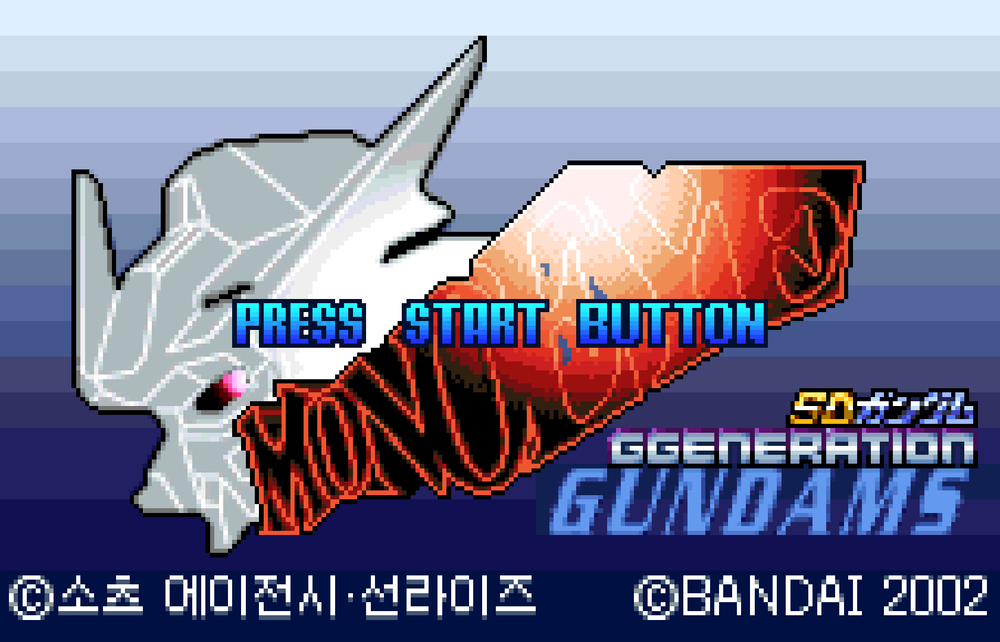

# SD Gundam G Generation: Mono-Eye Gundams 한글패치

> 한글패치 적용 화면 예시입니다. 게임 및 게임 내 이미지에 관한 권리는 각 권리자에게 있습니다. 이 프로젝트는 비공식·비상업 팬 번역 프로젝트입니다.

WonderSwan Color용 **SD Gundam G Generation: Mono-Eye Gundams** 비공식 한국어 패치 프로젝트입니다.

이 저장소는 원본 게임 ROM을 포함하지 않습니다. 배포 파일은 사용자가 **합법적으로 소유한 일본판 원본 ROM**에 적용하는 **xdelta 패치**입니다.

현재 릴리스는 **v1.1** 입니다. v1.0.1 이후 실플레이에서 확인된 시나리오 제어/초상 오류, 20셀 초과 잘림, 용어 불일치, 확장 사전 alias 충돌 가능성을 정리하고 전역 구조·폭 감사를 강화했습니다. 2026-08-16 후속 검수에서 필/디아나 교신 이벤트 제어 영역, `한겔그`·`김 깅가남`·`해리` 표기, V2 어설트 버스터 MA 아이콘 raw 타일 코드, `사전` UI까지 추가 수정해 같은 v1.1 배포본에 누적했습니다. 자세한 변경 사항은 [`RELEASE_NOTES_v1.1.md`](RELEASE_NOTES_v1.1.md)를 확인해 주세요.

## 한글화 진행 현황

**현재 식별된 사용자 가시 번역 대상 기준 완료도: 100%**

| 영역 | 상태 | 주요 범위 |
|---|---:|---|
| 시나리오·이벤트 대사 | **완료** | 메인 시나리오, 분기/후속 이벤트, 제어문·줄바꿈·화자/초상 구조 후속 수정 포함 |
| 전투대사 | **완료** | 파일럿·함장·브리지 음성, 중복 레코드 및 런타임 구조 오류 후속 수정 포함 |
| 도감·기체명·인명·무장명 | **완료** | 캐릭터/유닛 도감, 기체·무장·고유명사 및 용어 표준화 반영 |
| 메뉴·UI·시스템 문구 | **완료** | 전투/인터미션/UI 라벨, 도움말, 정신기·ID 커맨드 관련 문구 포함 |
| 스테이지 타이틀 그래픽 | **43 / 43** | 실제 그래픽 디스크립터 전체 한글화 및 메인TIP 승격 |
| 전투 팝업 그래픽 | **11 / 11** | I-필드, 크리티컬, 미스, 월광접 등 공용 배틀 팝업 전체 |
| 타이틀 메뉴 그래픽 | **29 플레이트** | 타이틀/메뉴 플레이트 한글화 및 실화면 검증 |
| ID 커맨드·결과 플레이트 | **완료** | 본체 플레이트와 후속 잔여 그래픽 수정까지 메인TIP에 반영 |

여기서 **100%는 현재 확인·분류된 플레이어 가시 번역 대상의 완료 상태**를 뜻합니다. ROM 안의 모든 일본어 바이트, 미사용 데이터, 구조용 사전 엔트리까지 제거했다는 의미는 아닙니다. 실제로 최신 감사에는 플레이어에게 표시되지 않는 일본어 사전 엔트리가 일부 남아 있지만, 스캔된 사용자 가시 레코드의 소비처는 없는 것으로 확인되었습니다. 이후 실기/에뮬레이터 플레이에서 미번역 문구나 일본어 잔여가 발견되면 번역률 미달이 아니라 **버그/누락 항목으로 추적하여 수정**합니다.

## 가장 빠른 적용 방법

1. **합법적으로 소유한 일본판 원본 `.wsc` ROM**을 준비합니다.
2. 원본 ROM의 SHA-256이 아래 값과 같은지 확인합니다.
   - `376E4C6B4B81CC3A7DCEB15DC4B7D0AF04D3E6C8B81E8572569C39D3394870A0`
3. `out/dist/monoeye_ko_expanded_v1.1.xdelta`를 받습니다.
4. Delta Patcher 같은 xdelta 호환 프로그램에서 원본 ROM에 패치를 적용합니다.
5. 결과 ROM은 **16 MiB (16,777,216 bytes)** 가 되어야 합니다.
6. 패치된 ROM의 SHA-256이 아래 값이면 정상입니다.
   - `F62F14D15F3D76AD2EB33E2B55531AB4781D230CB63BCC2348BBD703D8C39BE3`

처음 적용하거나 오류가 발생한다면 [`PATCH_GUIDE.md`](PATCH_GUIDE.md)를 확인해 주세요.

## 현재 배포 파일

- `out/dist/monoeye_ko_expanded_v1.1.xdelta` — **v1.1** 실제 배포용 패치
- `out/dist/monoeye_ko_expanded_v1.1_xdelta.json` — 버전/원본/출력/xdelta 해시와 빌드 정보
- `out/dist/monoeye_ko_expanded_v1.1_XDELTA_README.md` — 자동 생성된 xdelta 기술 정보
- `out/dist/SHA256SUMS_v1.1.txt` — 확인용 SHA-256 목록
- `RELEASE_NOTES_v1.1.md` — v1.0.1 이후 누적 변경 사항

현재 xdelta 자체의 SHA-256:

`F114AC45D2EFAD024537C452FD5924D972C02AC8F92BB7BE5C06456EB6E6C8C4`

xdelta 생성 후 원본 ROM에 다시 적용하여 **현재 메인 TIP과 byte-exact로 동일한 결과가 나오는 것까지 검증**합니다. 현재 배포 xdelta는 xdeltaUI/구버전 xdelta3 호환을 위해 VCDIFF secondary compression(LZMA)을 사용하지 않습니다.

## 주의사항

- 이미 패치된 ROM에 다시 적용하지 마세요.
- 원본 ROM의 용량이나 해시가 다르면 정상 적용을 보장하지 않습니다.
- 원본 ROM과 세이브 파일은 반드시 별도로 백업해 두세요.
- 이 패치는 ROM을 8 MiB에서 16 MiB로 확장합니다.
- 프로젝트 실측은 주로 BizHawk 2.11.1의 WonderSwan 계열 코어에서 진행했습니다.

## 문제 제보 시 필요한 정보

오류를 발견하면 가능하면 다음 정보를 함께 남겨 주세요.

- 문제가 발생한 장면 또는 스테이지
- 화면 캡처
- 보이는 대사/메뉴 문구
- 사용한 에뮬레이터와 버전
- 재현 절차
- 패치된 ROM의 SHA-256

같은 문구라도 도감, 시나리오, 전투대사, UI가 서로 다른 데이터 경로를 사용할 수 있어 화면 캡처가 있으면 원인 추적에 큰 도움이 됩니다.

## 개발자용 문서

패치 사용자가 아니라 개발/검증에 참여하려면 다음 문서를 참고하세요.

- [`docs/DEVELOPMENT.md`](docs/DEVELOPMENT.md) — 현재 메인TIP 및 빌드/검증 흐름
- [`docs/REPOSITORY_POLICY.md`](docs/REPOSITORY_POLICY.md) — GitHub에 포함할 파일과 제외할 파일 정책
- [`docs/TRANSLATION_SOURCE_POLICY.md`](docs/TRANSLATION_SOURCE_POLICY.md) — 번역 소스 관리 정책
- [`docs/SAVERAM_POLICY.md`](docs/SAVERAM_POLICY.md) — SaveRAM 취급 정책
- [`docs/LEGAL_NOTICE.md`](docs/LEGAL_NOTICE.md) — 법적 고지, 권리자 안내 및 공개 범위 원칙

재현 가능한 빌드를 위해 `data/`의 활성 번역/구조 사양은 공개 저장소에 포함합니다. 일부 사양에는 ROM의 올바른 위치와 버전을 검증하기 위한 일본어 원문 필드가 포함될 수 있습니다. 반면 전체 `PATCH_PROGRESS.md`처럼 빌드에 필요하지 않은 대규모 내부 실측 로그는 공개하지 않습니다. 장기적으로는 불필요한 원문 필드를 해시·길이·주소 기반 검증으로 대체해 공개 원문량을 줄이는 것을 목표로 합니다.

## 저작권 및 비공식 프로젝트 안내

이 프로젝트는 **비공식·비상업 팬 번역/호환성 연구 프로젝트**이며 게임의 제작사·유통사·플랫폼 권리자와 제휴, 후원 또는 승인 관계가 있음을 주장하지 않습니다. 게임, 등장인물, 기체, 명칭, 상표 및 원저작물에 관한 권리는 각 권리자에게 있습니다.

공개 배포에는 원본 ROM이나 패치 완료 ROM을 포함하지 않으며, 사용자가 **합법적으로 소유한 일본판 원본 ROM**에 적용하는 xdelta 차이 패치만 제공합니다. 다만 **xdelta 형식이라는 이유만으로 모든 저작권 문제가 자동으로 해소되거나 적법성이 보장되는 것은 아닙니다.** 원본 ROM 또는 패치 완료 ROM을 재배포하지 마세요.

이 저장소의 코드·문서 등 프로젝트 작성물에 관한 권리와 제3자 게임 콘텐츠에 관한 권리는 서로 별개입니다. 이 저장소는 제3자 게임 자산, 원문, 상표 또는 그 밖의 권리에 대한 라이선스를 부여하지 않습니다. 자세한 공개 범위, 권리자 요청 및 보증 부인은 [`docs/LEGAL_NOTICE.md`](docs/LEGAL_NOTICE.md)를 확인해 주세요.

## 라이선스

프로젝트가 자체 작성하고 라이선스를 부여할 권한이 있는 코드·도구·문서 등은 [`LICENSE`](LICENSE)의 **MIT License**로 공개합니다. MIT License는 원 게임이나 제3자 게임 콘텐츠에 대한 이용허락으로 확장되지 않습니다.

라이선스 적용 범위와 제3자 권리의 구분은 [`NOTICE.md`](NOTICE.md)를 반드시 함께 확인해 주세요. 특히 `data/`의 번역/검증 데이터에 원 게임의 짧은 원문이나 식별자가 포함되어 있더라도, 그 제3자 원저작물 자체에 MIT License가 부여되는 것은 아닙니다.
